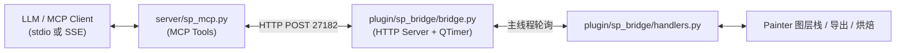

<div align="center">

# 🎨 Substance 3D Painter MCP Server (SP-MCP)

[](https://www.python.org/)
[](https://www.adobe.com/products/substance3d-painter.html)
[](https://github.com/jlowin/fastmcp)
[](https://pypi.org/project/requests/)

*让 AI 成为你的首席材质艺术家。*

本项目为 Substance 3D Painter 实现了一个 **MCP（Model Context Protocol）Server**，使得各大主流的 LLM（如 OpenCode, Claude Code, Cursor 等）能够通过标准化工具直接与 Painter 交互。该项目旨在利用大模型强大的推理与设计能力，自动化驱动 **视觉创作**（如材质设计、皮肤制作、磨损做旧等）工作流。

</div>

---

> [!IMPORTANT]  
> 该项目**必须**搭配支持视觉输入和支持工具调用（Tool Calling）的 LLM（缺一不可！），如 **Claude Sonnet 4/4.5/4.6, Claude Opus 4.5+, Kimi k2.6, Gemini 3.5 Flash, Gemini 3.1 Pro, Qwen 3.5/3.6** 等模型。材质创作工作流深度依赖 LLM 对截图的视觉评估来驱动迭代决策。

## 🎯 核心能力与工作流

通过本 MCP Server，AI 可以实现以下核心闭环操作：

1. 🔍 **理解当前状态**：读取 Painter 的图层栈结构、纹理集、项目信息。
2. 🧠 **制定修改决策**：分析并推断需要修改的材质参数。
3. 🛠️ **执行操作**：调用工具（如新建图层、添加材质/遮罩、调整通道值、批量操作）。
4. 👁️ **获取视觉反馈**：控制 Painter 截取 3D 视口画面。
5. 🔄 **迭代与确认**：根据截图进行多轮自我评估和修改，直到满意为止。
6. 📦 **烘焙与导出**：烘焙 mesh maps、导出贴图。

## ⚙️ 架构概述

本项目包含三大部分：

*   🔌 **`plugin/sp_bridge/` (SP 内嵌插件)**：作为 Painter 的 Python 插件运行，启动 HTTP Server（端口 `27182`），接收并执行 `substance_painter` API 调用。
*   🌐 **`server/` (MCP Server)**：基于 `FastMCP` 搭建的外部服务，暴露 MCP Tools 给 AI 客户端。
*   🖥️ **`plugin/js/` (QML 插件)**：SP 的 QML 插件，提供 UI 菜单项（Tools 菜单）。



## 🚀 安装与启动

### 环境要求
*   **Substance 3D Painter** 10.0.1+
*   **Python** 3.10+
*   **依赖库**: `fastmcp` (0.9+), `requests` (2.31+)

### 1. 部署 Painter 插件

**Python 插件（必需）：**

将 `plugin/sp_bridge/` 文件夹直接复制到以下路径：
```bash
%USERPROFILE%\Documents\Adobe\Adobe Substance 3D Painter\python\plugins\
```

**QML 插件（可选）：**

将 `plugin/js/` 下的各个文件夹复制到：
```bash
%USERPROFILE%\Documents\Adobe\Adobe Substance 3D Painter\plugins\
```

> **成功标志**：安装完成后启动 Painter，Python Console 会显示：
> `[INFO] sp_bridge: SP Bridge started on port 27182`

### 2. 安装 Python 依赖

```powershell
python -m venv .venv
.venv\Scripts\activate
pip install fastmcp requests
```

### 3. 配置 LLM 客户端

<details>
<summary><b>OpenCode</b></summary>

在 `~/.config/opencode/opencode.jsonc` 中添加：
```json
{
  "mcp": {
    "substance-painter": {
      "type": "local",
      "command": ["<Python路径>", "<仓库绝对路径>/server/sp_mcp.py"],
      "enabled": true,
      "timeout": 30000
    }
  }
}
```
</details>

<details>
<summary><b>Claude Code / Cursor / OpenClaw</b></summary>

```json
{
  "mcpServers": {
    "substance-painter": {
      "command": "<Python路径>",
      "args": ["<仓库绝对路径>/server/sp_mcp.py"]
    }
  }
}
```
</details>

<details>
<summary><b>Hermes Agent</b></summary>

在 `~/.hermes/config.yaml` 中添加：
```yaml
mcp_servers:
  substance-painter:
    command: "<Python路径>"
    args: ["<仓库绝对路径>/server/sp_mcp.py"]
```
</details>

### 4. 启动使用

1. 启动 Painter，打开一个项目
2. 确认 Console 显示 Bridge started
3. 启动 LLM 客户端
4. 💬 对话中直接使用：*"帮我看看当前 Painter 的图层结构"*

---

## 🛠️ MCP Tools (52 个)

> [!TIP]
> 所有图层修改操作（`add_fill_layer`、`set_layer_channel`、`apply_smart_material` 等）自动包裹 `ScopedModification`，**每个 API 调用 = 1 条 undo**。
> 用 `sp_begin_batch` / `sp_end_batch` 可将多个操作再合并为 1 条，方便撤销。

<details>
<summary><b>🔌 连接与项目管理 (4)</b></summary>

| Tool | 说明 |
|------|------|
| `sp_ping` | 检查 bridge 连通性，返回 SP 版本 |
| `sp_get_project_info` | 读取项目名/路径/状态 |
| `sp_save_project` | 保存项目 |
| `sp_run_python` | 【Escape Hatch】在主线程执行任意 Python |
</details>

<details>
<summary><b>📚 图层与纹理集读取 (4)</b></summary>

| Tool | 说明 |
|------|------|
| `sp_get_layer_stack` | 返回当前纹理集的图层树 JSON（含 Group 递归） |
| `sp_get_texture_sets` | 返回所有纹理集及图层结构，支持过滤 |
| `sp_get_layer_properties` | 返回图层详细属性 |
| `sp_get_layer_channels` | 返回所有通道的 opacity/blend/source |
</details>

<details>
<summary><b>✏️ 图层与通道写入 (10)</b></summary>

| Tool | 说明 |
|------|------|
| `sp_add_fill_layer` | 新建 Fill Layer（含颜色/通道/混合模式） |
| `sp_add_group_layer` | 新建空分组图层 |
| `sp_add_paint_layer` | 新建绘画图层 |
| `sp_set_layer_property` | 修改图层属性（opacity/visible/name/blend_mode） |
| `sp_set_layer_channel` | 设定通道值（Roughness/Metallic/Height/BaseColor/Normal） |
| `sp_delete_layer` | 删除图层 |
| `sp_duplicate_layer` | 复制图层 |
| `sp_move_layer` | 移动图层到目标上方/下方 |
| `sp_group_layers` | 打包图层进新分组 |
| `sp_ungroup_layer` | 解散分组，子层提升到父级 |
</details>

<details>
<summary><b>⏪ Undo / Redo 与批量操作 (4)</b></summary>

| Tool | 说明 |
|------|------|
| `sp_undo` | 撤销上一步（通过 SP 原生 QUndoStack） |
| `sp_redo` | 重做（通过 SP 原生 QUndoStack） |
| `sp_begin_batch` | 开始批量操作（基于 ScopedModification） |
| `sp_end_batch` | 结束批量，合并为单条 undo |
</details>

<details>
<summary><b>✨ 材质与效果 (5)</b></summary>

| Tool | 说明 |
|------|------|
| `sp_list_shelf_materials` | 列出可用 Smart Material，支持过滤 |
| `sp_apply_smart_material` | 对指定图层应用 Smart Material |
| `sp_list_materials` | 列出可用普通材质 |
| `sp_apply_material` | 应用普通材质 |
| `sp_add_smart_mask` | 为图层添加程序化遮罩 |
</details>

<details>
<summary><b>📸 视觉反馈与渲染 (8)</b></summary>

| Tool | 说明 |
|------|------|
| `sp_capture_viewport` | 截取 viewport（`"quick"` 迭代 / `"render"` Iray） |
| `sp_set_camera` | 设置相机位置和视角 |
| `sp_frame_mesh` | 自动适配视图到模型 |
| `sp_set_environment` | 切换 HDRI 环境光 |
| `sp_set_iray_params` | 设置 Iray 参数 |
| `sp_start_iray_render`| 异步启动 Iray |
| `sp_check_iray_render`| 检查渲染进度 |
| `sp_export_textures` | 导出贴图 |
</details>

<details>
<summary><b>🛠️ 纹理集与 JS API (5)</b></summary>

| Tool | 说明 |
|------|------|
| `sp_set_active_texture_set`| 切换活动纹理集 |
| `sp_set_texture_set_resolution`| 修改纹理集分辨率 |
| `sp_bake_mesh_maps` | 烘焙 mesh maps（AO/Curvature/Normal 等） |
| `sp_add_texture_set_channel` | 给纹理集添加通道 |
| `sp_remove_texture_set_channel`| 删除纹理集通道 |
</details>

<details>
<summary><b>🖱️ Computer Use (12)</b></summary>

> 通过 Windows API 实现 mini Computer Use，供视觉模型通过截图→坐标映射→鼠标点击/键盘输入驱动 SP UI。
> `sp_window_focus()` 会在 SP 窗口顶部显示红色 "MCP Control Active" 警示条，操作结束后用 `sp_cu_unlock()` 清除。

| Tool | 说明 |
|------|------|
| `sp_window_info` | 返回窗口位置/尺寸/状态，配合截图做坐标映射 |
| `sp_window_grab` | 截取 SP 窗口或指定区域 → base64 PNG |
| `sp_window_focus` | 聚焦 SP 窗口 + 显示红色警示条 |
| `sp_cu_unlock` | 解除锁定 + 隐藏警示条 |
| `sp_cu_banner_text` | 更新警示条文字 |
| `sp_cu_warning` | 将警示条切换为黄色等待状态（处理超时） |
| `sp_mouse_move` | 移动鼠标（屏幕/窗口相对坐标） |
| `sp_mouse_click` | 点击（左/右/中，单击/双击） |
| `sp_mouse_scroll` | 滚轮（±120） |
| `sp_mouse_drag` | 拖拽 A→B |
| `sp_key_send` | 键盘输入（单键/组合键/打字） |
| `sp_shortcut` | 预定义快捷键封装（save/undo/frame_all 等 26 种） |
</details>

---

## ⚠️ 已知限制

*   **视口状态**：`sp_capture_viewport` 需要项目打开且 3D viewport 可见。
*   **版本限制**：Smart Material API 需要 SP 10.0+，9.x 版本上相关 tool 会返回明确错误。
*   **ID 缓存**：Layer ID 在 Painter 重启后会变化，请勿跨 session 缓存。
*   **API 替代**：
    *   `schedule_on_ui_thread` 在 SP 10.x 不存在，已用 `QTimer` 轮询方案替代。
    *   `alg.ui.clickButton` 在 SP 10.0.1 有内部 bug（`findChild of undefined`），请使用 Computer Use 的鼠标点击绕过此限制。
*   **窗口前台**：Computer Use 鼠标/键盘输入受 Windows 前台窗口限制，操作前务必调用 `sp_window_focus()`。

## 🔧 调试与排错

| 问题 | 常见排查方案 |
|------|------|
| **Bridge 连接失败** | 检查 Painter 是否启动、Python Console 中插件是否加载成功 |
| **Timeout 异常** | Iray 渲染中会阻塞主线程，等待完成后重试 |
| **插件未加载** | 检查 Python Console 输出报错信息 |
| **查看运行日志** | `%USERPROFILE%\sp_bridge.log` |
| **代码热重载** | `import importlib, sp_bridge.handlers; importlib.reload(sp_bridge.handlers)` |
| **CU 警示条不消失** | 手动调用 `sp_cu_unlock()` 或是重启 Painter |

> 📚 详情及进阶开发指南可参阅代码库内的 [AGENTS.md](./AGENTS.md) 和 [PHASES.md](./PHASES.md)。
